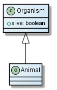
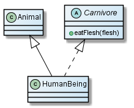

inheritance.js
==============

A pure-JavaScript Inheritance library designed to be easily dropped in to a host
library

✔ Pure Javascript (framework-agnostic)  
✔ Developer-friendly (enforce usage of native JavaScript functions)  
✔ No globals, no native functions enhancements  
✔ [Tested](test/)  

Installation
------------

    bower install inheritance

inheritance/inherit
-------------------

Simple Javascript inheritance:

    function Organism() {
      this.alive = true;
    }

    Organism.prototype.isAlive = function() {
      return this.alive;
    };

    function Animal() {
      Animal.parent.apply(this, arguments);
    }
    inherit(Animal, Organism);

    // ---

    new Animal() instanceof Animal; // true
    new Animal() instanceof Organism; // true
    new Animal().isAlive(); // true
    Animal.parent; // Organism

inheritance/implement
---------------------

Multiple inheritance through mixins:

    function Animal() {
    }

    // Carnivore mixin
    function Carnivore() {
      function eatFlesh(flesh) {
        console.log ('Blurp!');
      }
    }

    function HumanBeing() {
    }
    inherit(HumanBeing, Animal);
    implement(HumanBeing, Carnivore);

    // ---

    new HumanBeing() instanceof HumanBeing; // true
    new HumanBeing() instanceof Animal; // true
    HumanBeing.parent; // Animal
    new HumanBeing().eatFlesh({...}); // 'Blurp!'

Compatibility
-------------

✔ Google Chrome  
✔ Mozilla Firefox 3.6+  
✘ Internet Explorer 6 (untested)  
✘ Internet Explorer 7 (untested)  
✔ Internet Explorer 8+  
✘ Opera (untested)  

Licensing
---------

This project is released under [Creative Commons - Attribution 3.0 Unported](LICENSE-CC-BY.md)
license. If this license does not fit your requirement for whatever reason, but
you would be interested in using the work (as defined below) under another
license, please contact Alexandre Mercier at pro.alexandre.mercier@gmail.com .

Contributing
------------

Contributions (issues ♥, pull requests ♥♥♥) are more than welcome! Feel free to
clone, fork, modify, extend, etc, as long as you respect the [license terms](LICENSE-CC-BY.md).

**Installation**: after cloning the project, all you need to to is execute
`npm install && bower install`.

**Testing**: `grunt test`

**Committing**: before committing any JavaScript code, you need to execute
`grunt package` in order to generate compiled packages.
